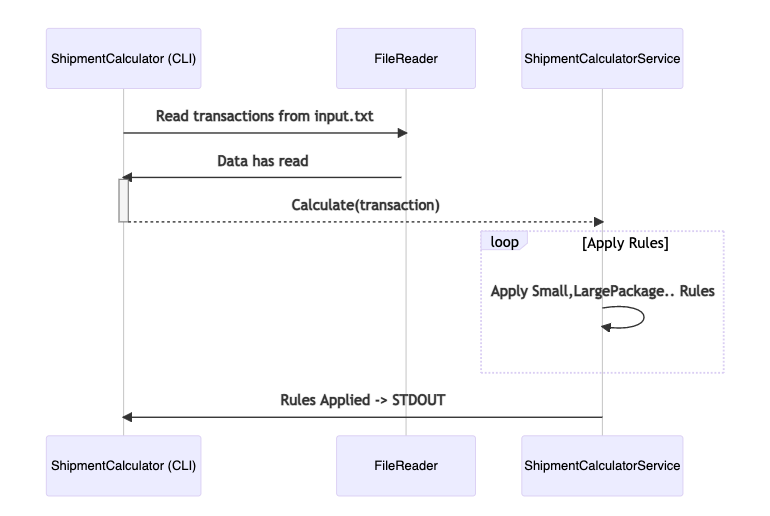
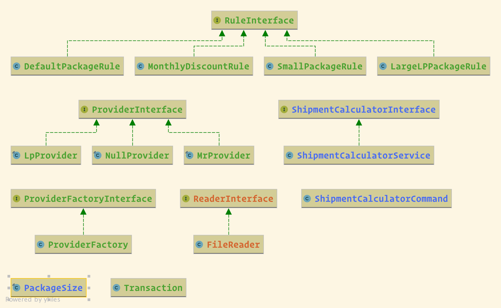

### Clarification
- I relayed on abstraction, not concretion so the project is loosely coupled we can easily add new rule or even provider smoothly
    - Following `RuleInterface` or `ProviderInterface` and register the new provider in `ProviderFactory`.
    - I used DI [Symfony Service Tag](https://symfony.com/doc/current/service_container/tags.html) to inject the rules.
- One more thing, I commit Symfony's files in one commit so please do not review Symfony's files :D.

### Shipment-Calculator Sequence Diagram

### Shipment-Calculator Class Diagram

## Installation
- Run `make up`

## Run Tests
- Run `make test`

## To calculate transaction shipment
- Run `make shipment-discount-calculate`

### Built With

* [PHP7.4](http://php.net)
* [Docker](https://www.docker.com/)
* [Symfony5](http://www.symfony.com) 
